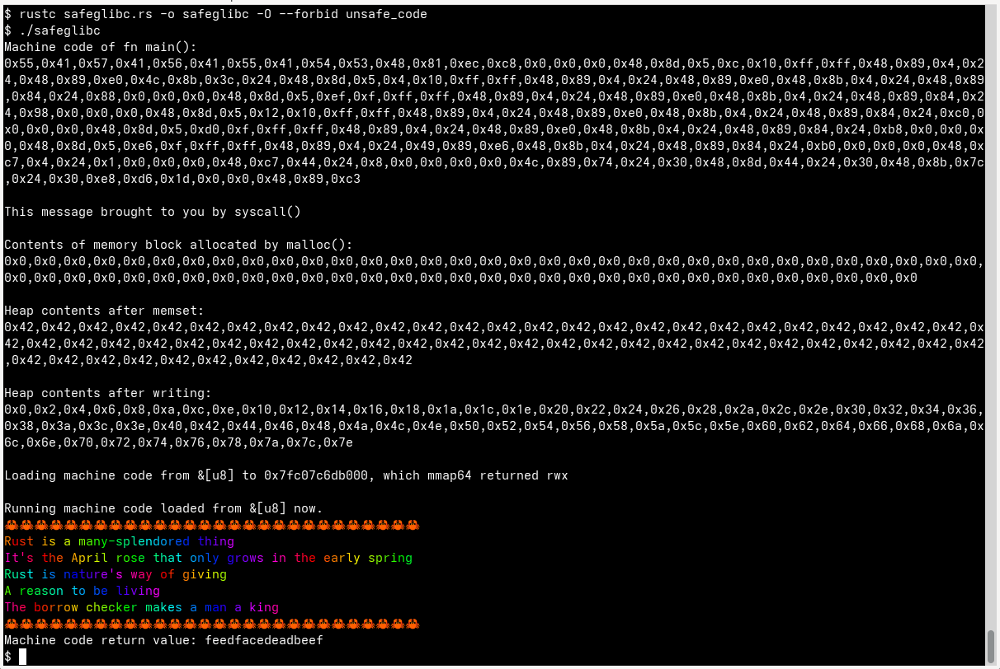

💯% 😷 Safe Rust 🦀

Uses the techniques featured in [https://github.com/Speykious/cve-rs](https://github.com/Speykious/cve-rs)
to get pointers to imported system and C runtime lib functions by reading
program instruction memory as a &[u8]. By finding call sites such as PLT stubs,
the GOT/IAT addresses can be computed from the offsets encoded in the JMP/CALL
instructions, then cast into callable Rust function pointers of any signature
using transmute<A,B>::() from cve-rs. References can also be cast into `usize`
and used as pointers on which arithmetic can easily be done.

At no time is any `unsafe_code` needed, either directly or indirectly: you
can do anything std::ffi can do without a single `unsafe`, and probably with
fewer restrictions. The soundness issue which allows for this to be possible
has been open since 2015.

~~After demoing, safely derefs a nulled reference for a 🥵 blazingly 🔥 fast
segfault.~~

Works on my machine, but may segfault safely for numerous reasons relating to
differences in the program binary when run, such as might exist between
binaries compiled by different versions of `rustc`. (My rustc is v1.91.1.)

